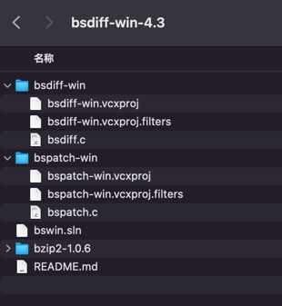

[APP升级---BsDiff增量更新](https://www.jianshu.com/p/7321070d6c98)

https://github.com/cnSchwarzer/bsdiff-win

BsDiff算法介绍：
bsdiff是由Conlin Percival开源的一个优秀的差分算法，而且是跨平台的。在目前很多大厂的app中都包含一个bspatch.so的库，其实主要是用于组装差分包的。感兴趣的同学可以看一下。增量更新使用的好处主要有两点：1、对用户来说，下载速度快，省流量，提高用户体验 2，对服务器来说，减少服务器的带宽压力。

$ ./gradlew assembleDebug --scan
org.gradle.java.home=/Library/Java/JavaVirtualMachines/jdk-17.jdk/Contents/Home
